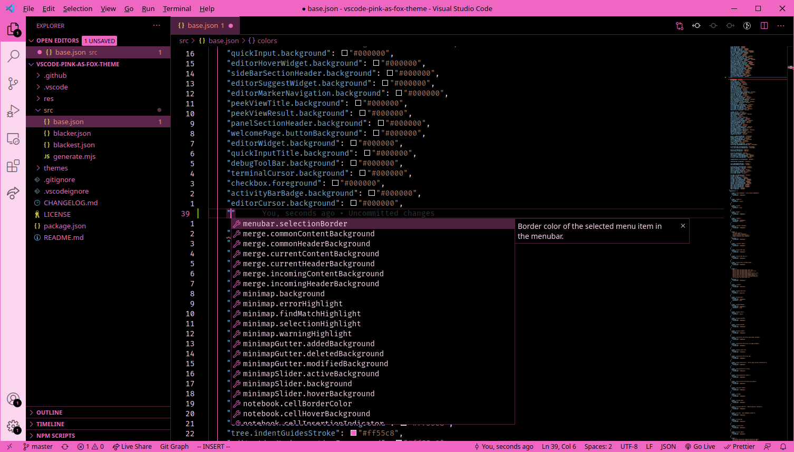
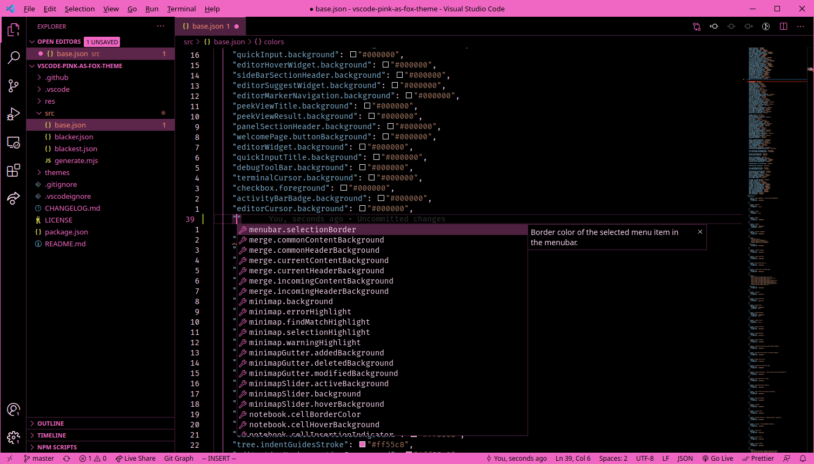
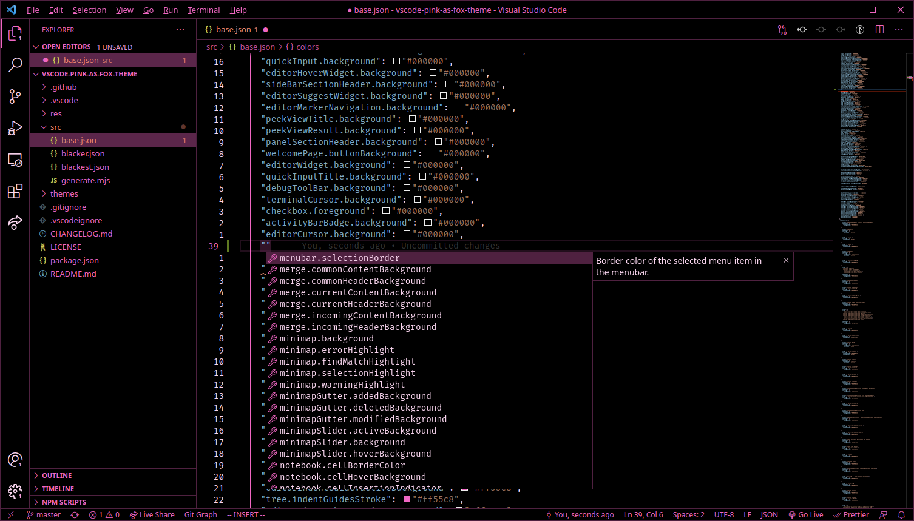

# Pink as Fox

A theme for Visual Studio Code based on the Dark+ builtin theme.

## Theme Variant `black`



## Theme Variant `blacker`



## Theme Variant `blackest`



## Font Recommendation

[Fira Code](https://github.com/tonsky/FiraCode)

## Settings Recommendations

```jsonc
{
    // pink/black titlebar instead of OS-default
    "window.titleBarStyle": "custom",
    // pink/black dialog instead of OS-default
    "window.dialogStyle": "custom",
    // pink/black save/open dialogs instead of OS-default
    "files.simpleDialog.enable": true,
}
```

## Credits

Icon by [Salem/Oat](https://www.spookyfoxinc.com/) (background + border edited by Avoonix)
